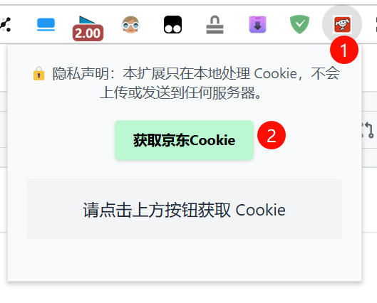

## 原项目地址:

https://github.com/topics/chrome-extension-react


## 前言

为了更方便的获取京东 Cookie，我基于原项目开发了这个插件
有需要的朋友可以自取

## 获取 JD Cookie 的插件

可以 clone 项目自己打包 or 修改
```
# 开发
pnpm run dev

# 打包
pnpm run build
```

## 使用说明

1. 提前安装好插件

2. 进入京东移动端地址: https://my.m.jd.com/
   - 登录账号

3. 点击插件, 去获取 cookie

